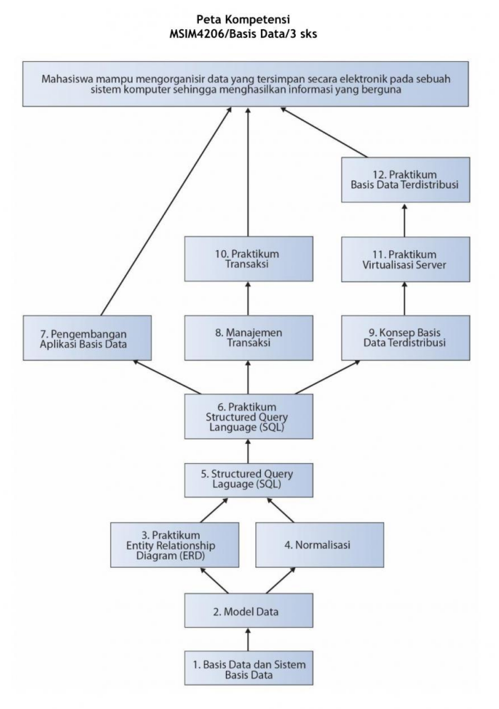

# MSIM4206

Basis Data

## Tinjauan Mata Kuliah

Mata kuliah basis data merupakan mata kuliah inti yang ditawarkan di Program Studi Sistem Informasi. Mata kuliah ini secara umum membahas tentang konsep, pengembangan dan penggunaan basis data. Sedangkan materi yang dibahas dalam mata kuliah ini adalah Model Data, Entity Relationship Diagram (ERD), Normalisasi, Structured Query Language (SQL), Manajemen Transaksi, Konsep Basis Data Terdistribusi, dan aplikasi sistem basis data.

Mata kuliah ini berbobot 3 sks yang terdiri dari 9 modul dengan paparan materi teori dan praktikum. Pembahasan teori terdapat pada Modul 1, 2, 4, 5, 7, dan 8. Sedangkan pembahasan praktikum terdapat pada Modul 3, 6, dan 9 dengan menggunakan berbagai tools praktikum diantaranya yEd Graph Editor, X Apache MySQL PHP dan Perl (XAMPP), dan Virtualbox. Adapun perincian pokok bahasan dari 9 modul tersebut terdiri dari sebagai berikut:

- [Modul 1 : Basis Data dan Sistem Basis Data](modul-01/README.md)
- Modul 2 : Model Data
- Modul 3 : Praktikum Pembuatan Entity Relationship Diagram (ERD)
- Modul 4 : Normalisasi
- Modul 5 : Structured Query Language (SQL)
- Modul 6 : Praktikum Structured Query Language (SQL)
- Modul 7 : Manajemen Transaksi dan Konsep Basis Data Terdistribusi
- Modul 8 : Pengembangan Aplikasi Sistem Basis Data
- Modul 9 : Praktikum Transaksi dan Basis Data Terdistribusi

Setelah mempelajari basis data ini, mahasiswa mampu mengorganisir data yang tersimpan secara elektronik pada sebuah sistem komputer sehingga menghasilkan informasi yang berguna. Secara lebih rinci mahasiswa mampu:

1. Menjelaskan definisi, tujuan, manfaat, kerugian, operasi, dan penerapan basis data serta sistem basis data secara keseluruhan.
2. Memahami model data, membuat basis data berelasi, dan membuat model ER .
3. Mengerti, memahami dan dapat mengimplementasikan setiap menu pada aplikasi yEd Graph Editor.
4. Menjelaskan dan mengimplementasikan Entity Relationship Diagram, Database Management System dan Struktur Tabel dengan Teknik Normalisasi Data, Proses atau Tahapan Normalisasi Anomali, Ketergantungan Fungsi Merancang Basis Data dengan Teknik Normalisasi, menjelaskan Redudansi dan bentuk-bentuk Denormalisasi, Atribut Turunan dan Atribut Berlebihan serta mampu mengimplementasikan dalam Database Manajement System (DBMS).
5. Menjelaskan dan menerapkan Structue Query Language (SQL) menggunakan DBMS MYSQL.
6. Mengetahui berbagai macam aplikasi basis data khususnya basis data MySQL dalam aplikasi XAMPP.
7. Memahami manajemen transaksi dan konsep basis data terdistribusi.
8. Menjelaskan dasar-dasar organisasi berkas, membuat studi kasus perencanaan basis data, dan membangun Aplikasi Sistem Basis Data.
9. Mengetahui bagaimana proses transaksi bekerja dalam basis data MySQL, melakukan installasi sistem operasi Linux Ubuntu pada aplikasi VirtualBox, dan mengetahui bagaimana replikasi basis data menggunakan MySQL menggunakan dua sistem operasi.

## Peta Kompetensi

