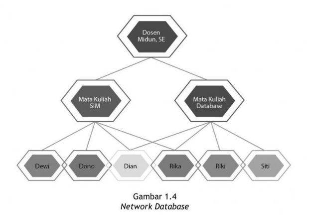
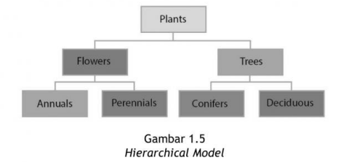
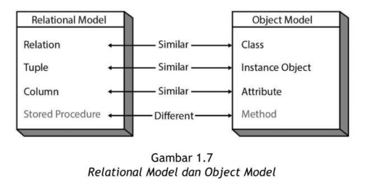
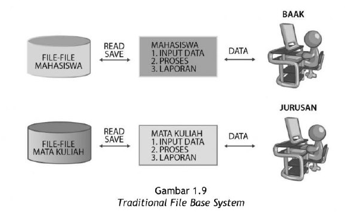
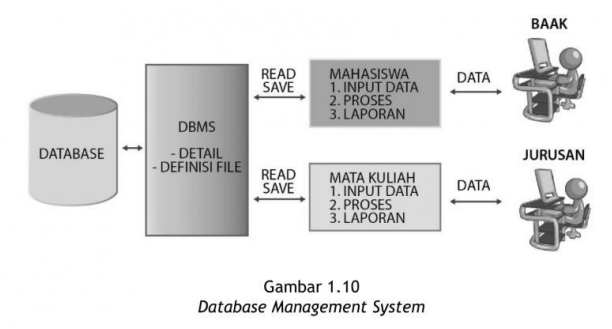

# Konsep Sistem Basis Data dan DBMS

Pada Kegiatan Belajar 2 ini akan membahas konsep sistem basis data dan DBMS. Seperti yang telah dipelajari sebelumnya, bahwa basis data adalah sekumpulan file atau tabel yang saling berhubungan antara satu dengan yang lainnya. File atau tabel tersebut memungkinkan dilakukan manipulasi data supaya memberikan sebuah informasi yang berguna.

## Daftar Isi

- [Konsep Sistem Basis Data dan DBMS](#konsep-sistem-basis-data-dan-dbms)
  - [Daftar Isi](#daftar-isi)
  - [PENGERTIAN SISTEM BASIS DATA DAN KOMPONEN SISTEM BASIS DATA](#pengertian-sistem-basis-data-dan-komponen-sistem-basis-data)
  - [KONSEP  DAN  SEJARAH DATABASE MANAGEMENT SYSTEM (DBMS)](#konsep--dan--sejarah-database-management-system-dbms)
    - [Sejarah Database Management System (DBMS)](#sejarah-database-management-system-dbms)
      - [Tahun 1960 Network Database](#tahun-1960-network-database)
      - [Tahun 1971 First Generation – Hierarchical Model](#tahun-1971-first-generation--hierarchical-model)
      - [Tahun 1976 Second Generation – Relational Model](#tahun-1976-second-generation--relational-model)
      - [Tahun 1990 Third Generation – Object Reletional dan Object Oriented](#tahun-1990-third-generation--object-reletional-dan-object-oriented)
  - [PENGGUNA (USER)](#pengguna-user)
  - [KLASIFIKASI DBMS](#klasifikasi-dbms)
    - [Klasifikasi Berdasarkan Model Data](#klasifikasi-berdasarkan-model-data)
    - [Klasifikasi Berdasarkan Jumlah Pengguna](#klasifikasi-berdasarkan-jumlah-pengguna)
    - [Klasifikasi Berdasarkan Sistem Distribusi](#klasifikasi-berdasarkan-sistem-distribusi)
  - [ABSTRAKSI DATA](#abstraksi-data)
    - [Level Fisik (Physical Level)](#level-fisik-physical-level)
    - [Level Logik / Konseptual (Conceptual Level)](#level-logik--konseptual-conceptual-level)
    - [Level Pandangan (View Level)](#level-pandangan-view-level)
  - [SISTEM INFORMASI, APLIKASI DAN DBMS](#sistem-informasi-aplikasi-dan-dbms)
  - [TRADITIONAL FILE BASE SYSTEM VS DATABASE MANAGEMENT SYSTEM](#traditional-file-base-system-vs-database-management-system)
    - [Traditional File Base System](#traditional-file-base-system)
    - [Database Management System](#database-management-system)
  - [RANGKUMAN](#rangkuman)

## PENGERTIAN SISTEM BASIS DATA DAN KOMPONEN SISTEM BASIS DATA

Berbeda dengan Basis Data (database), sistem basis data dapat diartikan sebagai suatu sistem yang di dalamnya terdiri dari koleksi data atau suatu kumpulan data yang saling berhubungan dan memungkinkan berbagai program untuk mengakses dan memanipulasi data tersebut. Sistem basis data juga merupakan suatu sistem yang menyusun dan mengelola data suatu organisasi, sehingga mampu menyediakan informasi yang diperlukan oleh pemakai.

Terdapat beberapa komponen dalam sebuah sistem basis data diantaranya:

1. Perangkat keras (hardware).
2. Sistem operasi (operating system).
3. Basis data (database).
4. DBMS (database management system), merupakan perangkat lunak (software) yang digunakan untuk menentukan bagaimana data tersebut dapat terorganisasi, tersimpan, diubah serta diambil kembali. DBMS ini pun yang menerapkan suatu mekanisme sebagai pengamanan data secara bersamaan, konsistensi data, dan semacamnya.
5. Pengguna (user). Pengguna ini dapat dikategorikan menjadi pengguna akhir atau end user, pemrogram aplikasi dan administrator basis data atau DBA (Database Administrator).
6. Program aplikasi (application program) adalah perangkat lunak yang ditulis atau dikembangkan oleh Programmer atau pemrogram aplikasi dan kemudian digunakan oleh end user atau pengguna akhir.

## KONSEP  DAN  SEJARAH DATABASE MANAGEMENT SYSTEM (DBMS)

Database Management System (DBMS) merupakan paket program (Software) yang digunakan untuk membuat dan mengelola basis data.  DBMS dibuat agar memudahkan dan mengefisienkan proses input, update, delete, restore, view, dan pengambilan informasi terhadap basis data. Tujuan utama DBMS adalah menyediakan lingkungan yang mudah dan nyaman bagi pengguna dalam mengambil, menyimpan data dan informasi. Software yang tergolong ke dalam DBMS antara lain, Microsoft SQL, MySQL, Oracle, MS. Access, dan lain-lain.

### Sejarah Database Management System (DBMS)

#### Tahun 1960 Network Database

Sejarah sebuah basis data diawali tahun 1960. Pada awal tahun tersebut,  Charles Bachman membuat sebuah desain DBMS pertama yang disebut dengan penyimpanan data terintegrasi. Desain DBMS tersebut berbentuk sebuah model jaringan basis data (network database). Model jaringan basis data tersebut distandarisasi oleh Conference on Data System Language (CODASYL). Gambar 1.4 merupakan contoh dari network database.



Network database terdiri dari kumpulan record yang dihubungkan melalui pointer yang membentuk relasi antar record. Model ini tidak memungkinkan banyak relasi namun mudah dalam menyisipkan data.

#### Tahun 1971 First Generation – Hierarchical Model

DBMS generasi pertama yaitu model hirarki (hierarchical model). Model hirarki ini merupakan kumpulan record yang dihubungkan satu sama lain berdasarkan pointer berbentuk pohon. Gambar 1.5 merupakan contoh dari model hirarki.



#### Tahun 1976 Second Generation – Relational Model

Pada tahun 1976 generasi kedua dari DBMS yaitu dengan penerapan model relasi (relational model). Dengan model relasi ini, data terorganisir dengan baik sehingga dapat dengan mudah dilakukan manipulasi data dan menghasilkan sebuah informasi yang baik. Gambar 1.6 berikut merupakan contoh dari model relasi.


Pada Gambar 1.6 tabel PART atau SUKU CADANG berelasi dengan tabel DELIVERY dan tabel SUPPLIER.

#### Tahun 1990 Third Generation – Object Reletional dan Object Oriented

Generasi berikutnya muncul pada tahun 1990 yaitu object relational dan object oriented. Generasi ini merupakan sebuah respon terkait dengan berkembangnya bahasa pemograman berorientasi objek, atribut, dan metode. Gambar 1.7 berikut ilustrasi kemiripan antara Relational Model dan Object Model.



## PENGGUNA (USER)  

Pengguna dapat digolongkan menjadi 3 yaitu:

1. Pengguna Akhir atau end user, dapat dibagi menjadi 2, yaitu
   a. Pengguna aplikasi adalah orang yang bertugas mengoperasikan program aplikasi. Program aplikasinya telah dibuat oleh pemrogram aplikasi sehingga pengguna aplikasi tinggal mengoperasikannya saja.
   b. Pengguna interaktif adalah orang yang dapat memberikan perintah-perintah pada antar muka basis data menggunakan SQL, misalnya SELECT, INSERT, UPDATE, DELETE.
2. Pemrogram aplikasi adalah orang yang membuat program aplikasi menggunakan basis data dan bahasa pemograman.
3. Administrator basis data atau  DBA (Database Administrator) adalah orang yang bertanggungjawab terhadap pengelolaan basis data. Tugas dari DBA diantaranya:
   a. Mendefinisikan basis data.
   b. Menentukan isi basis data.
   c. Menentukan keamanan basis data.

## KLASIFIKASI DBMS

Suatu DBMS dapat diklasifikasikan ke dalam beberapa kriteria diantaranya sebagai berikut:

### Klasifikasi Berdasarkan Model Data

Beberapa model data adalah model data relasi atau sering disebut DBMS, model data hierarki, dan model data jaringan. Model data yang paling sering digunakan saat ini adalah model data relasional atau DBMS. Sedangkan aplikasi yang mendukung model data relasi adalah Oracle, MS SQL Server, DB2, dan MySQL mendukung model ini.

Dalam beberapa tahun terakhir, terdapat model data baru yaitu model data berorientasi objek. Model ini merupakan sistem manajemen basis data dimana informasi direpresentasikan dalam bentuk objek seperti yang digunakan dalam pemrograman berorientasi objek. Basis data berorientasi objek berbeda dari basis data relasional atau yang berorientasi tabel. Sistem manajemen basis data berorientasi objek (OODBMS) menggabungkan kemampuan basis data dengan kemampuan bahasa pemrograman berorientasi objek. Model berorientasi objek belum menangkap seperti yang diharapkan sehingga tidak digunakan secara luas. Beberapa contoh DBMS berorientasi objek adalah O2, ObjectStore, dan Jasmine.

### Klasifikasi Berdasarkan Jumlah Pengguna

DBMS dapat diklasifikasikan berdasarkan jumlah pengguna yang didukungnya. DBMS ini bisa berupa sistem basis data pengguna tunggal, yang mendukung satu pengguna dalam satu waktu, atau sistem basis data multi pengguna, yang mendukung banyak pengguna secara bersamaan.

### Klasifikasi Berdasarkan Sistem Distribusi

Ada empat sistem distribusi utama dalam klasifikasi basis data ini diantaranya sistem terpusat dimana basis data disimpan dalam sebuah server terpusat dan digunakan oleh beberapa sistem lainnya. Kemudian sistem database terdistribusi yaitu basis data aktual dan perangkat lunak DBMS didistribusikan dari berbagai server yang dihubungkan oleh jaringan komputer. Sistem database terdistribusi homogen yaitu menggunakan perangkat lunak DBMS yang sama dari beberapa server. Pertukaran data antara berbagai situs ini dapat ditangani dengan mudah. Kemudian yang terakhir sistem database terdistribusi heterogen yaitu server yang berbeda mungkin menggunakan perangkat lunak DBMS yang berbeda, tetapi ada perangkat lunak umum tambahan untuk mendukung pertukaran data di antara server tersebut.

## ABSTRAKSI DATA

DBMS memiliki tujuan untuk menyediakan interface kepada pengguna. Abstraksi data merupakan tingkatan-tingkatan pengguna dalam memandang bagaimana sebenarnya data diolah dalam sebuah sistem basis data sehingga menyerupai kondisi yang sebenarnya dihadapi oleh pengguna dalam kehidupan sehari-hari. Sebuah DBMS seringkali menyembunyikan secara rinci tentang bagaimana sebuah data disimpan dan dipelihara (diolah) dalam sebuah sistem basis data. Hal ini bertujuan untuk memudahkan pengguna dalam menggunakan DBMS tersebut. Oleh karena itu, pengguna seringkali melihat perbedaan data sebelumnya dengan data yang tersimpan secara fisik.

Terdapat 3 level abstraksi yaitu:

### Level Fisik (Physical Level)

Level fisik merupakan lapisan terendah. Lapisan ini menjelaskan bagaimana (how) data sesungguhnya disimpan. Pada lapisan inilah struktur data dijabarkan secara terperinci.

### Level Logik / Konseptual (Conceptual Level)

Level konseptual lebih tinggi dari lapisan fisik. Lapisan ini menjabarkan data apa (what) saja yang sesungguhnya disimpan pada basis data dan juga menjabarkan hubungan-hubungan antar data secara keseluruhan. Seorang pengguna dalam level ini dapat mengetahui bahwa data mahasiswa disimpan pada tabel mahasiswa, tabel KRS, tabel transkrip, dan lain sebagainya. Level ini biasa dipakai oleh DBA (Database Administrator).

### Level Pandangan (View Level)

Level pandangan merupakan lapisan tertinggi pada abstraksi data. Pada lapisan ini pengguna hanya mengenal struktur data sederhana yang berorientasi pada kebutuhan pengguna. Data yang dikenal oleh setiap pengguna bisa berbeda-beda dan barangkali hanya mencakup sebagian dari basis data. Misalnya, bagian keuangan hanya membutuhkan data keuangan, jadi yang digambarkan hanya pandangan terhadap data keuangan saja. Begitu juga dengan bagian akuntansi, hanya membutuhkan data akuntansi. Jadi, tidak semua pengguna basis data membutuhkan seluruh informasi yang terdapat dalam basis data tersebut.

Sebagai gambaran, misalnya terdapat struktur data bertipe record seperti berikut:

```txt
Pegawai = RECORD
  Nama  : STRING;
  Alamat  : STRING;
  Bagian : STRING;
  Gaji  : LongInt;
End:
```

Pada contoh ini record pegawai berisi 4 buah field (nama, alamat, bagian, dan gaji). Setiap field memiliki nama dan setiap nama memiliki tipe data.

Pada level fisik, pegawai dapat dijabarkan sebagai blok data yang terletak pada lokasi berurutan (satuan byte). Pada lapisan konseptual, masing-masing record dijabarkan dengan definisi tipe data. Pada lapisan view, user tertentu hanya boleh mengakses data tertentu. Contohnya seorang yang menangani penggajian berhak mengetahui gaji seseorang bahkan mengubahnya. Akan tetapi orang yang bekerja di bagian lain tentu tidak boleh melihatnya.

## SISTEM INFORMASI, APLIKASI DAN DBMS

Dalam kehidupan sehari-hari, sering ditemui sistem informasi dan aplikasi. Sistem informasi merupakan kombinasi dari beberapa teknologi informasi dengan aktivitas pengguna untuk dapat memenuhi kebutuhan sebuah organisasi. Sebagai contoh Sistem Informasi Perpustakaan, Sistem Informasi Akademis, Sistem Informasi Penggajian, Dan Sistem Informasi Persediaan.

Beberapa penjelasan tentang keterkaitan antara basis data dan sistem informasi adalah sebagai berikut:

1. Dalam pengembangan sistem informasi diperlukan basis data sebagai media penyimpan data untuk menghasilkan informasi secara tepat, akurat, dan bermanfaat.
2. Sistem informasi merupakan kombinasi teratur dari manusia, hardware, software, jaringan komunikasi, dan sumber daya data, yang mengumpulkan, mengubah, dan menyebarkan informasi dalam sebuah organisasi.

Sedangkan aplikasi adalah program yang menentukan aktivitas pemrosesan data dan menghasilkan informasi yang dibutuhkan untuk penyelesaian tugas-tugas khusus dari pengguna komputer contohnya spreadsheet elektronic dan aplikasi word processing. Seperti yang dapat dilihat pada Gambar 1.8 berikut ini:


Pada gambar (A) merupakan gambaran dari sistem informasi di mana beberapa aktivitas pengguna sedang mengakses sebuah DBMS menggunakan kombinasi dari beberapa teknologi. Sedangkan pada gambar (B) merupakan contoh aplikasi yang ada pada sebuah sistem operasi. Aplikasi-aplikasi tersebut siap digunakan oleh pengguna sesuai dengan kebutuhannya.

## TRADITIONAL FILE BASE SYSTEM VS DATABASE MANAGEMENT SYSTEM

### Traditional File Base System

Sistem pemrosesan traditional file base system ini sekelompok rekaman disimpan pada sejumlah berkas secara terpisah. Pada umumnya, perancangan sistem didasarkan pada kebutuhan individual pemakai, bukan berdasarkan kebutuhan sejumlah pemakai. Sebagai contoh dapat anda lihat pada Gambar 1.9 berikut:



Gambar 1.9 menjelaskan sebuah sistem informasi akademik perguruan tinggi. Terdapat dua unit yang terpisah yaitu BAAK dan  JURUSAN. Kedua unit tersebut masing-masing memiliki basis data yang terpisah dan disimpan pada masing-masing file. Dengan traditional file base system file-file tersebut terpisah sehingga akan sulit dalam hal mendapatkan data atau dalam proses pertukaran data.

### Database Management System

Berbeda dengan traditional file base system. Pada sistem ini record-record data disimpan pada satu tempat yakni basis data dan di antara program aplikasi maupun pemakai terdapat DBMS (Database Management System). Pada gambar 1.10, baik BAAK dan JURUSAN sudah saling terhubung sehingga dapat memudahkan dalam proses mendapatkan sebuah informasi.



Perbedaan antara Traditional File Base System (FBS) dengan Database Management System (DBMS):

| No  | Faktor Pembeda                | FBS                                                                                             | DBMS                                                                                                                                                              |
| --- | ----------------------------- | ----------------------------------------------------------------------------------------------- | ----------------------------------------------------------------------------------------------------------------------------------------------------------------- |
| 1   | Pemisahan dan pembatasan data | a. Setiap program memelihara datanya masing-masing                                              | a. Mengutamakan penggunaan data bersama-sama untuk seluruh program                                                                                                |
|     |                               | b. Tidak ada kesadaran bahwa data dapat dipakai bersama-sama                                    | b. Adanya kesadaran bahwa data dapat dipakai bersama-sama                                                                                                         |
| 2   | Duplikasi data                | a. Setiap sistem informasi dapat memiliki file yang sama                                        | a. Tidak ada duplikasi data                                                                                                                                       |
|     |                               | b. Boros penyimpanan data                                                                       | b. Hemat penyimpanan data                                                                                                                                         |
| 3   | Ketergantungan Data           | Definisi file terdapat pada program sehingga sulit untuk mengubah struktur file                 | Definisi file tidak terdapat pada DBMS                                                                                                                            |
| 4   | Format                        | Berbeda-beda format, baik nama file, tipe data, panjang data ataupun dengan desimal atau tidak. | Format sama                                                                                                                                                       |
| 5   | Fleksibelitas                 | Setiap adanya kebutuhan baru, maka diperlukan pembuatan program baru                            | Terdapat fasilitas query sehingga memungkinkan dengan adanya kebutuhan baru maka dapat saja tidak perlu melakukan pembuatan program baru untuk query atau laporan |
| 6   | Kelebihan                     | a. Biaya lebih murah                                                                            | a. Mengontrol redudansi data                                                                                                                                      |
|     |                               | b. Ukuran lebih kecil                                                                           | b. Konsistensi data                                                                                                                                               |
|     |                               | c. Sederhana                                                                                    | c. Pemakaian data bersama                                                                                                                                         |
|     |                               | d. Dampak yang lebih rendah terhadap kegagalan.                                                 | d. Meningkatkan integritas data                                                                                                                                   |
|     |                               |                                                                                                 | e. Meningkatnya keamanan basis data                                                                                                                               |
|     |                               |                                                                                                 | f. Meningkatnya standarisasi                                                                                                                                      |
|     |                               |                                                                                                 | g. Meningkatnya skala ekonomi                                                                                                                                     |
|     |                               |                                                                                                 | h. Keseimbangan konflik kebutuhan                                                                                                                                 |
|     |                               |                                                                                                 | i. Meningkatnya akses data dan tanggapan                                                                                                                          |
|     |                               |                                                                                                 | j. Meningkatnya produktivitas                                                                                                                                     |
|     |                               |                                                                                                 | k. Meningkatnya pemeliharaan karena independensi data                                                                                                             |
|     |                               |                                                                                                 | l. Meningkatnya konkurensi Meningkatnya service backup dan recovery                                                                                               |
| 7   | Kelemahan                     | a. Pemisahan dan pembatasan data                                                                | a. Harga DBMS mahal                                                                                                                                               |
|     |                               | b. Duplikasi data                                                                               | b. Ukuran                                                                                                                                                         |
|     |                               | c. Ketergantungan data                                                                          | c. Kompleksitas                                                                                                                                                   |
|     |                               | d. Format tidak sama                                                                            | d. Penambahan biayaperangkat keras                                                                                                                                |
|     |                               | e. Tidak fleksibel jika terjadi perubahan                                                       | e. Adanya biaya konversi                                                                                                                                          |
|     |                               | f. Kurangnya keamanan data                                                                      | f. Kegagalan                                                                                                                                                      |
|     |                               | g. Sulit untuk melakukan backup dan recovery jika terjadi crash                                 |                                                                                                                                                                   |
|     |                               | h. Kurangnya standardisasi                                                                      |                                                                                                                                                                   |
|     |                               | i. Kurangnya integritas data                                                                    |                                                                                                                                                                   |
|     |                               | j. Kurangnya adanya pemakaian data secara bersamaan                                             |                                                                                                                                                                   |
|     |                               | k. Data tidak konsisten                                                                         |                                                                                                                                                                   |

## RANGKUMAN

Sistem basis data dapat di artikan suatu sistem yang didalamnya terdiri dari koleksi data atau dari suatu kumpulan data yang saling berhubungan dan memungkinkan berbagai program untuk mangakses dan memanipulasi data tersebut. Sistem basis data juga merupakan suatu sistem yang menyusun dan mengelola data organisasi perusahaan, sehingga mampu menyediakan informasi yang diperlukan oleh pemakai Database Management System (DBMS) merupakan paket program (Software) yang digunakan untuk membuat dan mengelola basis data.  DBMS dibuat agar memudahkan dan mengefisienkan input, update, delete, backup, restore, view, dan pengambilan informasi terhadap basis data.
